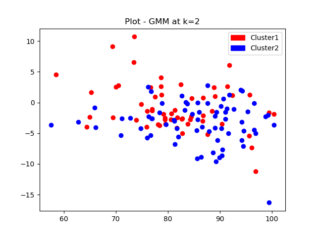

# ML_models_from_scratch
ML models from scratch in Python

𝒌-NN algorithm for MNIST handwritten digits recognition. 
𑘠= 1, 3, 5, 10, 20, 30, 40, 50, 60  
 

K-means algorithm for clustering. 
K  =  [2, 3, 4, 5, 6, 7, 8, 9]  
 

Gaussian Mixture Model. 

